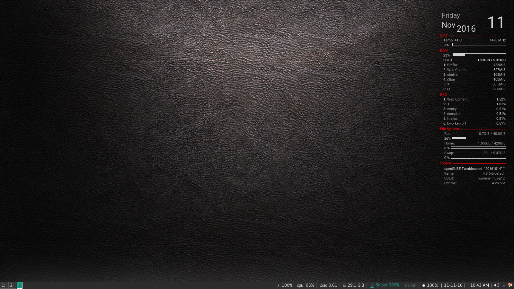

# A I3wm Tumbleweed
What it all looks like when all done...

## Must
Must have KDE installed first with pulseaudio

## What's in it
1. blurlock
2. morc_menu
3. mouse toggle program
4. dust
5. conky
6. OpenSuse_Kde_software.sh 'Change and add what you want and need'

